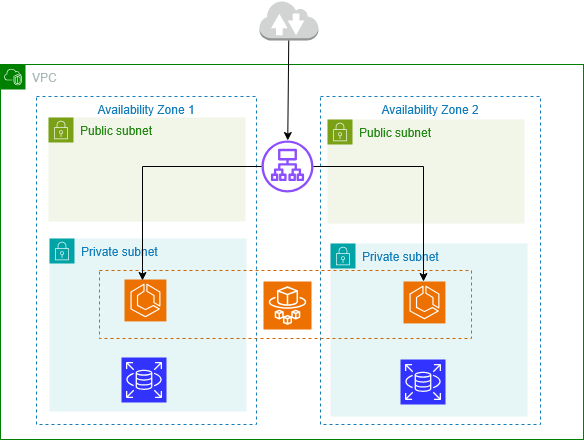

# Project 7 – 3-tier AWS (ALB → ECS Fargate → RDS Postgres)

## Architecture
- Public: Application Load Balancer (HTTP)
- Private: ECS Fargate service
- Private: RDS PostgreSQL
- Logs: CloudWatch Log Group
- CI/CD: GitHub Actions (OIDC) build Docker image → push ECR → force new ECS deployment

## Outputs
- ALB DNS (when running): http://p7-3tier-dev-alb-749288646.eu-central-1.elb.amazonaws.com
- ECR: 329771247218.dkr.ecr.eu-central-1.amazonaws.com/p7-3tier-dev-app
- RDS endpoint (private): p7-3tier-dev-db.cxgkswya624y.eu-central-1.rds.amazonaws.com
- Log group: /ecs/p7-3tier-dev

## Endpoints
- `/`        : hello
- `/health`  : health check
- `/db`      : database connection test

## Test (End-to-end)
- Open `/`, `/health`, `/db` via ALB DNS
- Stop 1 ECS task → service self-heals, new task runs automatically

## Deploy
- `terraform init`
- `terraform apply`
- Push code → GitHub Actions deploys to ECS using OIDC (no access keys)

## Cleanup
- `terraform destroy`
